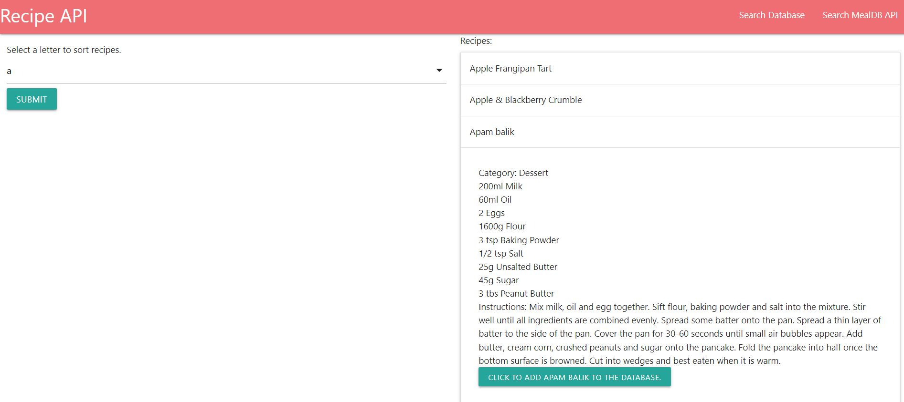
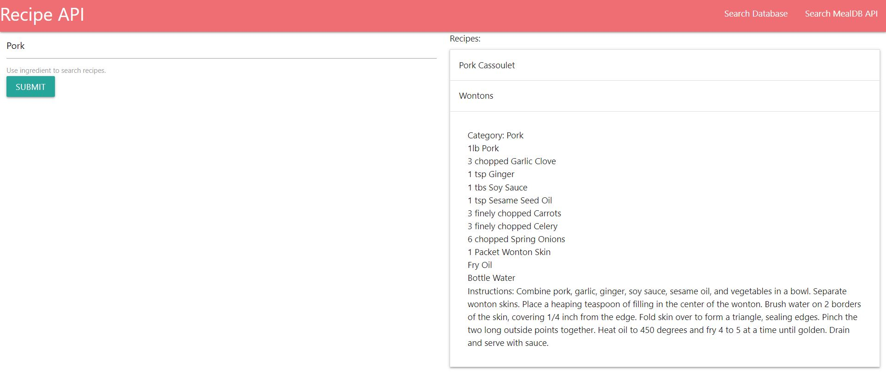

# MealDB_API

Application link: https://secret-atoll-62245.herokuapp.com/

## Description

This application uses MealDB API to load meal recipes alphabetically. Users can store selected recipes in MySQL database. Then, without hitting the MealDB API, users can search the database for recipes based on specific ingredients. This application was created using Express.js, JavaScript, Materialize, MySQL, Sequelize and HTML.

## Authentication

1. Search for recipes alphabetically.

2. Add recipes to database by clicking on button to add to database.
3. Click "Search Database" in navigation bar to navigate to Database API. 
4. Search for recipes via ingredients such as "chicken" or "asparagus."

## Questions

Please find me on GitHub [nicolepingar](https://github.com/nicolepingar) or email me at nicolepingar@gmail.com.